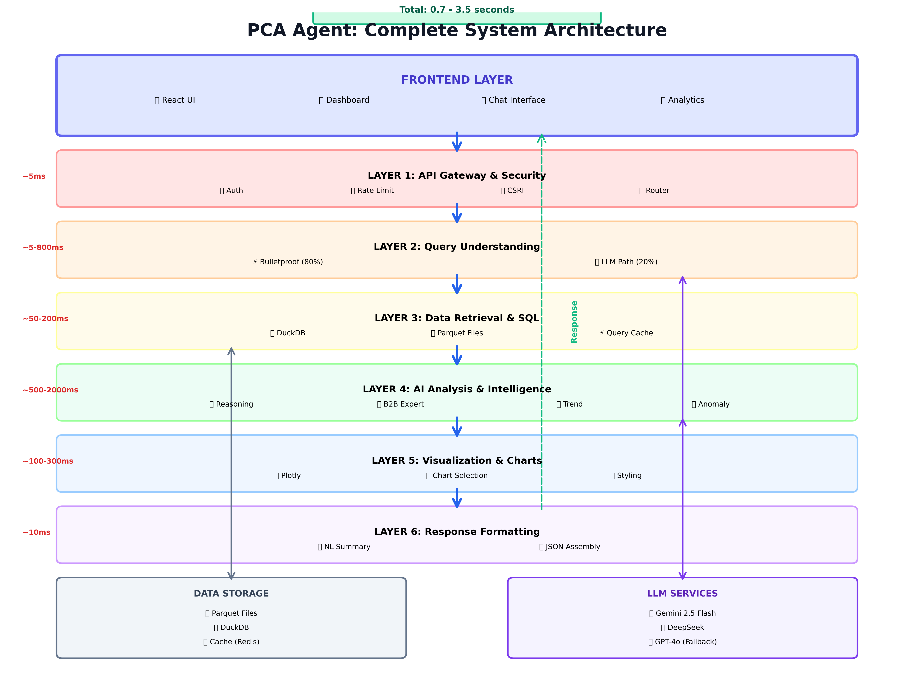
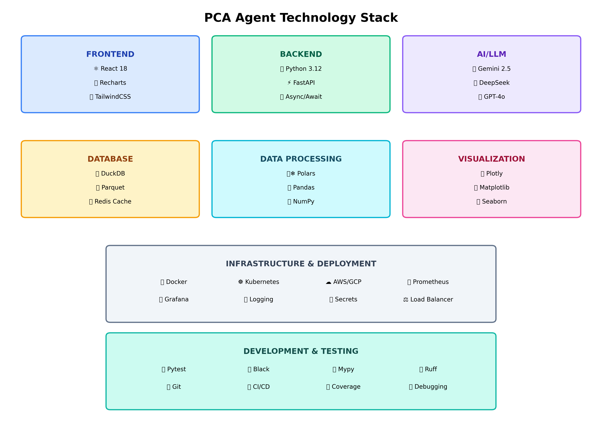
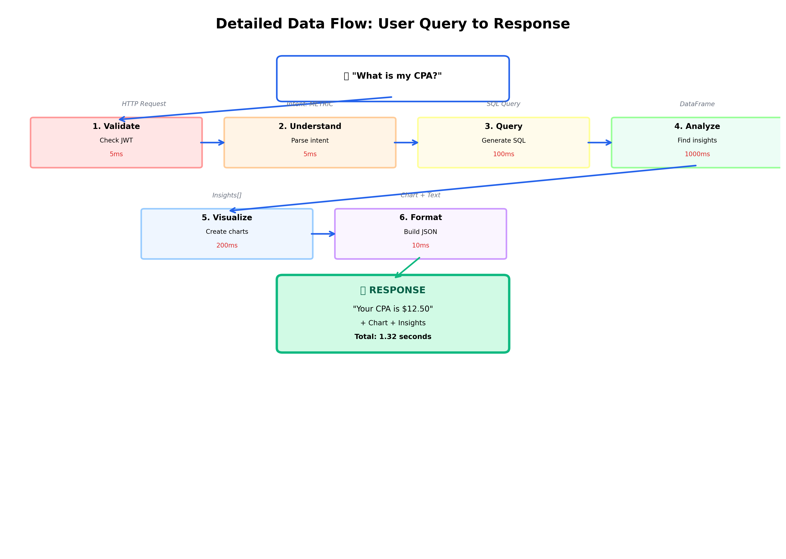

**CHAPTER 1**

**INTRODUCTION & OVERVIEW**

---

**Navigation:** [← Index](file:///Users/ashwin/Desktop/pca_agent%20copy/guide/INDEX.md) | [Chapter 2 →](file:///Users/ashwin/Desktop/pca_agent%20copy/guide/chapters/02_architecture_overview.md)

---

## 1.1 Executive Summary

The Performance Campaign Analytics (PCA) Agent represents a paradigm shift in marketing analytics, enabling natural language interaction with complex campaign data. This system eliminates the traditional dependency on data analysts for routine queries by leveraging artificial intelligence to understand questions, generate SQL queries, analyze results, and present insights through interactive visualizations.

**Core Value Proposition:** Transform hours-long analytical workflows into second-long conversational interactions while maintaining accuracy and depth of insight.

> **Office Analogy:** Imagine you have a super-efficient assistant who knows everything about your marketing campaigns. Instead of waiting days for the analytics team to prepare a report, you just ask your assistant "How much did we spend last week?" and they instantly pull up the answer with charts. That's what the PCA Agent does.

---

## 1.2 System Overview

The PCA Agent is an enterprise-grade AI system designed to democratize access to marketing performance data. Users interact with the system using natural language queries, receiving comprehensive responses that include numerical answers, visual charts, and actionable insights.

**Example Interaction:**

User Query: *"What is my CPA for last week?"*

System Response: *"Your Cost Per Acquisition last week was $12.50, representing an 8% decrease from the previous week. This improvement is primarily driven by increased conversion rates in your Facebook campaigns."*

The response includes:
- Numerical answer with context
- Trend comparison
- Root cause analysis
- Interactive visualization

> **Real-World Example:** Think of asking Siri or Alexa a question, but instead of weather or music, you're asking about your marketing data. You speak naturally ("What's my CPA?") and get an intelligent answer back, not just raw numbers.

---

## 1.3 Problem Statement

### 1.3.1 Traditional Analytics Workflow

The conventional marketing analytics process involves multiple stakeholders and significant time delays:

1. Marketing manager formulates a business question
2. Request is submitted to data analytics team
3. Data analyst translates question into SQL query
4. Query execution and data extraction
5. Manual analysis and chart creation
6. Report generation and delivery

> **Office Analogy:** This is like needing to file a formal request with HR every time you want to know your vacation balance. You submit a ticket, wait for someone to look it up, wait for them to create a report, and finally get an email days later. Frustrating and slow!

**Key Challenges:**
- **Time Inefficiency:** 4-48 hour turnaround for simple queries
- **Resource Constraints:** Requires dedicated analyst time
- **Iteration Friction:** Follow-up questions restart the entire cycle
- **Static Outputs:** Reports become outdated quickly

### 1.3.2 PCA Agent Solution

The PCA Agent compresses this multi-day workflow into a sub-second interaction:

1. User asks question in natural language
2. System processes and responds immediately

> **Office Analogy:** Now imagine you have a self-service portal where you can instantly check your vacation balance, request time off, and see approval status - all in seconds. That's the transformation the PCA Agent brings to marketing analytics.

**Quantified Benefits:**
- **Speed:** 99% reduction in time-to-insight (hours → seconds)
- **Cost:** 80% reduction in analyst workload for routine queries
- **Accessibility:** Non-technical users gain data independence
- **Interactivity:** Real-time exploration with dynamic visualizations

---

## 1.4 Architectural Philosophy

The PCA Agent employs a six-layer architecture, where each layer performs a distinct function in the request-response lifecycle. This modular design ensures maintainability, testability, and scalability.

> **Office Analogy - The Document Processing Chain:**
> 
> Imagine you submit an expense report at your company. It goes through multiple departments:
> 1. **Reception (Layer 1):** Checks if you're an employee and if the form is complete
> 2. **Classification (Layer 2):** Determines what type of expense (travel, meals, equipment)
> 3. **Data Entry (Layer 3):** Pulls up your records and budget information
> 4. **Analysis (Layer 4):** Checks if it's within policy, compares to your budget
> 5. **Presentation (Layer 5):** Creates an approval form with all details
> 6. **Delivery (Layer 6):** Sends you an email with the decision
> 
> Each department has one job, and they pass the work to the next department. That's exactly how the PCA Agent's layers work!

**Layer Hierarchy:**

| Layer | Function | Office Department Analogy |
|-------|----------|--------------------------|
| Layer 1 | API Gateway | Reception / Security Desk |
| Layer 2 | Query Understanding | Mail Room (sorts & routes) |
| Layer 3 | Data Retrieval | Records Department |
| Layer 4 | Analysis | Analysis Team |
| Layer 5 | Visualization | Graphics Department |
| Layer 6 | Response Assembly | Executive Summary Writer |

Each layer maintains strict input/output contracts, enabling independent optimization and testing.

---

## 1.5 Technology Stack

### 1.5.1 Artificial Intelligence Layer

**Large Language Models (LLMs):**

> **What is an LLM?** A Large Language Model is an artificial intelligence system trained on vast amounts of text data (books, websites, code) that can understand and generate human-like text.
>
> **Office Analogy:** Imagine you hire someone who has read every business book, every marketing guide, and every data analysis manual ever written. They've also read millions of reports from other companies. When you ask them a question, they can draw on all that knowledge to give you an intelligent answer. That's what an LLM does - it's like having an expert consultant who has "read everything."

The system employs a tiered LLM strategy to balance cost, speed, and capability:

- **Primary:** Gemini 2.5 Flash (Google) - Zero-cost, optimized for speed
- **Secondary:** DeepSeek - Zero-cost, specialized for code generation
- **Tertiary:** GPT-4o (OpenAI) - Premium capability for complex queries

**Selection Logic:** The system attempts free models first, escalating to paid models only when necessary, optimizing for cost efficiency.

> **Why multiple LLMs?** Different AI models have different strengths.
>
> **Office Analogy:** Think of it like having three consultants:
> - **Gemini (Fast & Free):** Your in-house analyst who can answer most questions quickly
> - **DeepSeek (Code Specialist):** Your IT specialist who's great at technical queries
> - **GPT-4o (Premium Expert):** The expensive external consultant you only call for really complex problems
>
> You try the free in-house people first, and only pay for the expensive consultant when absolutely necessary.

### 1.5.2 Data Processing Infrastructure

**DuckDB:**

> **What is DuckDB?** DuckDB is a specialized database designed for analytics. Unlike traditional databases (like MySQL or PostgreSQL) that are optimized for many small transactions (like processing credit card payments), DuckDB is optimized for analyzing large amounts of data quickly.
>
> **Office Analogy - The Filing System:**
> 
> **Traditional Database (MySQL):** Like a bank teller's cash drawer. Perfect for handling thousands of small, quick transactions (deposits, withdrawals). Every transaction is carefully recorded one at a time.
>
> **DuckDB:** Like a research library's archive system. Not great for individual transactions, but excellent when you need to analyze thousands of documents at once. "Show me all expense reports from last year where travel costs exceeded $5,000" - DuckDB can scan through millions of records in seconds.
>
> **The Difference:** If you need to process one credit card payment, use a traditional database. If you need to analyze a year's worth of sales data, use DuckDB. It's 10-100x faster for analytics!

An in-memory analytical database engine providing:
- 10-100x performance improvement over traditional RDBMS for analytical workloads
- Native Parquet file support (zero-copy data access)
- ACID compliance with analytical optimization

> **What is Parquet?** Parquet is a file format specifically designed for storing large datasets efficiently. Instead of storing data row-by-row (like a spreadsheet), it stores data column-by-column.
>
> **Office Analogy - The Filing Cabinet:**
>
> **Row-based storage (Excel):** Each employee's file is stored together. To find "all salaries," you have to open every single employee file and look at the salary page. Slow!
>
> **Column-based storage (Parquet):** All salaries are stored together in one drawer, all names in another drawer, all departments in another. To find "all salaries," you just open the salary drawer. Fast!
>
> This is why Parquet is perfect for questions like "What's the total spend?" - it only reads the "spend" column, not every row.

**Polars & Pandas:**

> **What are Polars and Pandas?** These are Python libraries for working with data tables (think Excel spreadsheets, but in code). Pandas has been around longer and is widely used, but Polars is newer and significantly faster.
>
> **Office Analogy:** 
> - **Pandas:** Like Microsoft Excel - everyone knows it, lots of plugins, but can be slow with huge files
> - **Polars:** Like a new, supercharged spreadsheet app that's 5-10x faster but not everyone knows how to use it yet
>
> We use Polars for the heavy lifting (processing millions of rows) and Pandas when we need to work with other tools that only understand Pandas.

Complementary data manipulation frameworks:
- **Polars:** High-performance operations on large datasets (5-10x faster than Pandas)
- **Pandas:** Ecosystem compatibility and final formatting

### 1.5.3 Application Framework

**FastAPI:**

> **What is FastAPI?** FastAPI is a web framework - the foundation that handles HTTP requests (when you click a button in your browser, it sends an HTTP request). It's called "Fast" because it's one of the fastest Python web frameworks available, and "API" because it helps build APIs (Application Programming Interfaces - the way different software systems talk to each other).
>
> **Office Analogy - The Receptionist:**
>
> When someone calls your office, the receptionist:
> 1. Answers the phone (receives the request)
> 2. Asks who they want to talk to (routes the request)
> 3. Transfers them to the right person (sends to the right handler)
> 4. Takes a message if needed (handles errors)
>
> FastAPI is like a super-efficient receptionist who can handle hundreds of calls simultaneously without getting confused.

Modern Python web framework selected for:
- Asynchronous request handling
- Automatic OpenAPI documentation generation
- Built-in data validation (Pydantic)
- Industry-leading performance benchmarks

> **What is asynchronous?** 
>
> **Office Analogy - The Restaurant:**
>
> **Synchronous (Old Way):** The waiter takes your order, goes to the kitchen, stands there waiting for your food, brings it back, then takes the next table's order. One customer at a time. Slow!
>
> **Asynchronous (FastAPI Way):** The waiter takes orders from 5 tables, submits them all to the kitchen, the kitchen works on them in parallel, and the waiter delivers food as it's ready. Multiple customers served simultaneously. Fast!
>
> FastAPI works asynchronously, handling multiple user questions at the same time without making anyone wait.

### 1.5.4 Visualization Engine

**Plotly & Recharts:**

> **What are Plotly and Recharts?** These are charting libraries - tools for creating graphs and visualizations. Plotly creates interactive charts on the backend (Python), while Recharts creates them on the frontend (JavaScript in the browser).
>
> **Office Analogy:** 
> - **Plotly:** Like having a graphics designer in your office who creates beautiful charts
> - **Recharts:** Like having design software on your computer where you can create charts yourself
>
> **Interactive** means you can hover over data points to see details, zoom in/out, and toggle data series on/off - like a PowerPoint presentation where you can click on charts to explore them.

Interactive charting libraries enabling:
- Client-side interactivity (zoom, pan, hover)
- Responsive design for multiple screen sizes
- Export capabilities (PNG, SVG, PDF)

---

## 1.6 Request Lifecycle Example

To illustrate the system's operation, consider a simple aggregation query:

**User Question:** *"What is my total spend?"*

**Processing Flow:**

1. **Layer 1 (5ms):** Validates JWT authentication token, confirms rate limit compliance, routes to chat endpoint

> **What is JWT?** JWT (JSON Web Token) is like a digital ID card. When you log in, the system gives you a JWT that proves who you are. Every time you make a request, you show this JWT instead of entering your password again. It contains your user ID and is cryptographically signed so it can't be forged.

2. **Layer 2 (5ms):** Pattern matcher identifies "total spend" keyword, classifies intent as AGGREGATION

> **What is intent classification?** This is the process of figuring out what you're trying to do. Are you asking for a total (AGGREGATION)? Comparing two things (COMPARISON)? Looking at trends over time (TREND)? The system classifies your question into one of these categories to know how to answer it.

3. **Layer 3 (50ms):** Retrieves pre-built SQL template, executes `SELECT SUM(spend) FROM campaigns`, returns $1,234,567

> **What is SQL?** SQL (Structured Query Language) is the language databases understand. It's like asking the database a question in its native language. `SELECT SUM(spend) FROM campaigns` means "add up all the spend values from the campaigns table."

4. **Layer 4 (10ms):** Determines no complex analysis required for simple aggregation
5. **Layer 5 (100ms):** Generates gauge chart visualization with spend value
6. **Layer 6 (10ms):** Formats JSON response with formatted number ($1.23M) and chart object

> **What is JSON?** JSON (JavaScript Object Notation) is a format for structuring data that both humans and computers can easily read. It's like a standardized way of packaging information. Example: `{"answer": "$1.23M", "chart": {...}}` packages the answer and chart together.

**Total Latency:** 180 milliseconds

---

## 1.7 Target User Personas

### 1.7.1 Marketing Managers

**Primary Use Cases:**
- Campaign performance monitoring
- Budget allocation decisions
- Competitive channel analysis

**Value Delivered:** Eliminates analyst dependency for routine questions, enabling real-time decision-making.

### 1.7.2 Data Analysts

**Primary Use Cases:**
- Rapid hypothesis testing
- SQL query validation
- Automated report generation

**Value Delivered:** Reduces time spent on repetitive queries, allowing focus on strategic analysis.

### 1.7.3 Executive Leadership

**Primary Use Cases:**
- High-level KPI monitoring
- Strategic performance assessment
- Board presentation preparation

**Value Delivered:** Self-service access to current data without technical barriers.

---

## 1.8 Intelligent Capabilities

### 1.8.1 Semantic Understanding

> **What is semantic understanding?** Semantic means "meaning." Semantic understanding is the ability to understand what words mean in context, not just match keywords. The system understands that "bleeding money" means "high spend with low returns," even though those exact words aren't in the database.

The system interprets colloquial language and domain-specific terminology:

**Example:** *"Show me campaigns that are bleeding money"*

**Interpretation:** High spend combined with low return on ad spend (ROAS < 1.0)

**Generated SQL:** `WHERE spend > 1000 AND roas < 1.0`

### 1.8.2 Contextual Awareness

> **What is contextual awareness?** This is the ability to remember what was discussed earlier in the conversation. Like talking to a human who remembers what you said 30 seconds ago, the system maintains conversation history to understand follow-up questions.

The system maintains conversation history to resolve ambiguous references:

**Conversation:**
- User: *"How is Google performing?"*
- Agent: *[Provides Google campaign metrics]*
- User: *"What about Facebook?"*

**System Understanding:** User requests comparative analysis between Facebook and previously discussed Google campaigns.

### 1.8.3 Intelligent Defaults

When users provide incomplete specifications, the system applies reasonable assumptions:

**User Query:** *"Show me performance"*

**System Assumptions:**
- Time range: Last 30 days
- Metrics: Spend, ROAS, CPA (core KPIs)
- Granularity: Daily aggregation

> **Why defaults matter:** Without defaults, you'd have to specify every detail every time. "Show me spend, ROAS, and CPA for the last 30 days, grouped by day" is tedious. The system knows what you probably want and fills in the blanks.

### 1.8.4 Fault Tolerance

> **What is fault tolerance?** This is the system's ability to handle errors gracefully. Instead of crashing when something goes wrong, it tries alternative approaches or provides helpful error messages.

The system implements multi-tier fallback mechanisms:

1. Attempt primary LLM (Gemini)
2. If failure, attempt secondary LLM (DeepSeek)
3. If failure, attempt tertiary LLM (GPT-4o)
4. If failure, use simplified template-based approach
5. If failure, return graceful error with suggested reformulation

**Design Principle:** Maximize answer availability while maintaining accuracy.

---

## 1.9 System Requirements

### 1.9.1 End-User Requirements

- Modern web browser (Chrome 90+, Firefox 88+, Safari 14+)
- Stable internet connection (minimum 1 Mbps)
- No client-side software installation required

### 1.9.2 Deployment Requirements

**Compute Resources:**
- Python 3.12 or higher
- Minimum 4GB RAM (8GB recommended)
- 2 CPU cores (4 cores recommended)

**Data Infrastructure:**
- DuckDB (bundled with application)
- Parquet-formatted campaign data
- Optional: PostgreSQL for persistent storage

**External Dependencies:**
- OpenAI API key (for GPT-4o access)
- Google AI API key (for Gemini access)
- Optional: DeepSeek API key

---

## 1.10 Document Roadmap

This guide provides comprehensive technical documentation across twelve chapters:

**Chapters 2-8:** Detailed examination of each architectural layer, including input specifications, processing logic, component descriptions, and output formats.

**Chapter 9:** Deep dive into multi-agent orchestration patterns and coordination mechanisms.

**Chapter 10:** Real-world examples demonstrating complete request flows for various query types.

**Chapters 11-12:** Advanced features including RAG integration, knowledge graphs, and observability infrastructure.

**Appendices:** Glossary of technical terms and comprehensive code reference.

---

**Next Chapter:** [Chapter 2: The Six-Layer Architecture](file:///Users/ashwin/Desktop/pca_agent%20copy/guide/chapters/02_architecture_overview.md)

**Navigation:** [← Index](file:///Users/ashwin/Desktop/pca_agent%20copy/guide/INDEX.md) | [Chapter 2 →](file:///Users/ashwin/Desktop/pca_agent%20copy/guide/chapters/02_architecture_overview.md)
