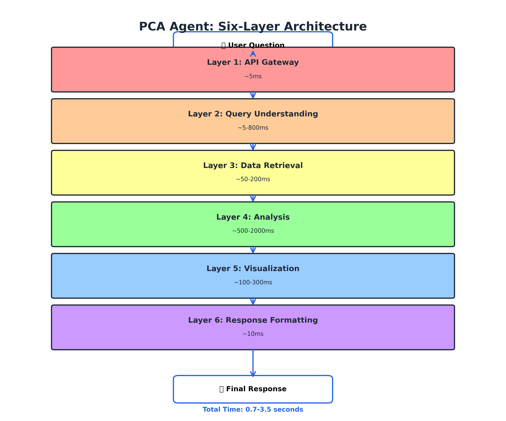
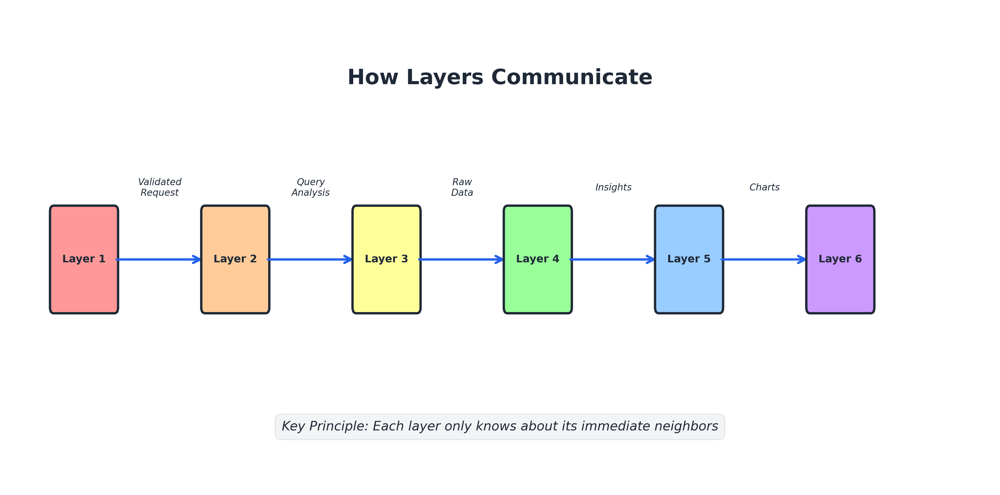
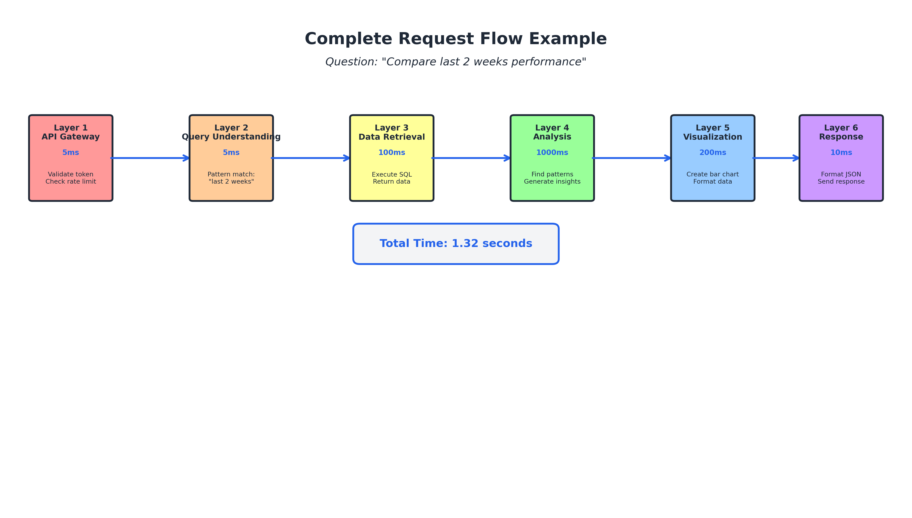
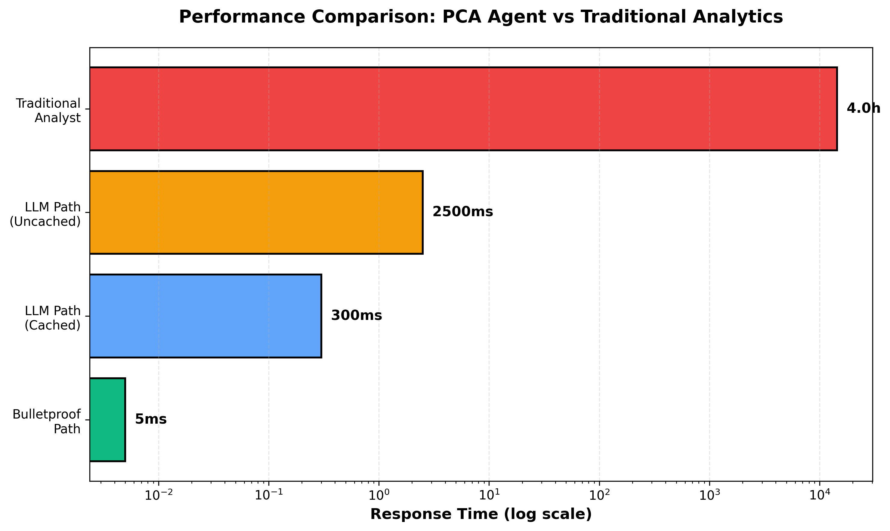
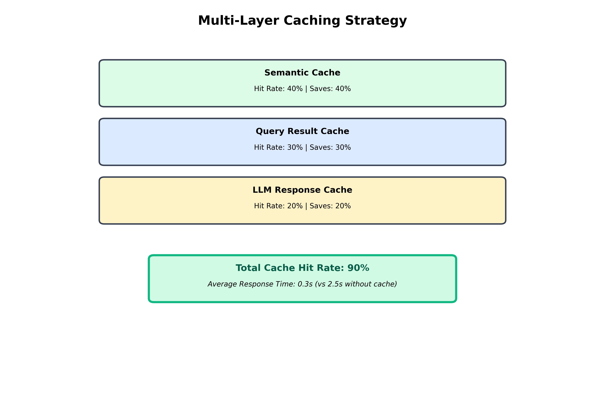
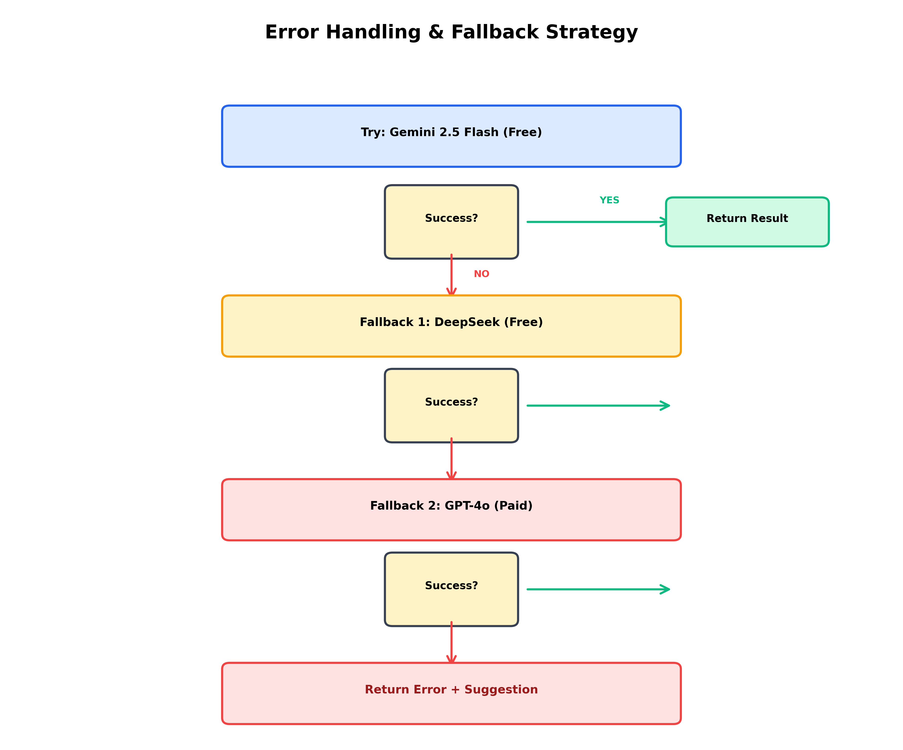

**CHAPTER 2**

**THE SIX-LAYER ARCHITECTURE**

---

**Navigation:** [← Chapter 1](file:///Users/ashwin/Desktop/pca_agent%20copy/guide/chapters/01_introduction.md) | [Index](file:///Users/ashwin/Desktop/pca_agent%20copy/guide/INDEX.md) | [Next: Chapter 3 →](file:///Users/ashwin/Desktop/pca_agent%20copy/guide/chapters/03_layer1_api_gateway.md)

---

## 2.1 Overview of All Layers

The PCA Agent is built using a **layered architecture** where each layer has a single, well-defined responsibility.

> **Office Analogy - The Assembly Line:**
>
> Think of a car manufacturing plant. Each station on the assembly line has ONE job:
> - Station 1: Install the engine
> - Station 2: Attach the wheels
> - Station 3: Paint the body
> - Station 4: Install the interior
> - Station 5: Quality inspection
> - Station 6: Final detailing
>
> Each station is an expert at their one task. If there's a problem with painting, you only fix Station 3 - you don't need to touch the engine installation. That's exactly how the PCA Agent's layers work!

This design makes the system:
- ✅ **Easier to understand** - Each layer is simple on its own
- ✅ **Easier to test** - Test each layer independently
- ✅ **Easier to maintain** - Fix bugs in one layer without affecting others
- ✅ **Easier to scale** - Optimize slow layers without touching fast ones

---

## 2.2 The Six Layers

> **Complete Office Analogy - Processing a Purchase Order:**
>
> Imagine you submit a purchase order at your company. Here's the journey:
>
> 1. **Security Desk (Layer 1):** Checks your employee badge and verifies you're authorized to make purchases
> 2. **Mail Room (Layer 2):** Reads your request and determines what department should handle it (IT equipment? Office supplies? Travel?)
> 3. **Records Department (Layer 3):** Pulls up your budget, past purchases, and available funds
> 4. **Analysis Team (Layer 4):** Reviews if this purchase makes sense, compares prices, checks if it's within policy
> 5. **Graphics Department (Layer 5):** Creates an approval form with charts showing budget impact
> 6. **Executive Assistant (Layer 6):** Packages everything into a nice email and sends it to you
>
> **Total time:** A few seconds instead of days!



**Layer Timing:**

| Layer | Function | Time | Office Equivalent |
|-------|----------|------|-------------------|
| Layer 1 | API Gateway | ~5ms | Security checkpoint |
| Layer 2 | Query Understanding | ~5-800ms | Mail room sorting |
| Layer 3 | Data Retrieval | ~50-200ms | Records lookup |
| Layer 4 | Analysis | ~500-2000ms | Analysis team review |
| Layer 5 | Visualization | ~100-300ms | Graphics creation |
| Layer 6 | Response Formatting | ~10ms | Final packaging |
| **Total** | **Complete Response** | **0.7-3.5s** | **Instant approval!** |

---

## 2.3 Layer-by-Layer Breakdown

### Layer 1: API Gateway & Request Routing

**Time:** ~5ms  
**Purpose:** Security checkpoint and traffic director

> **Office Analogy:** The security desk at your office building. They:
> - Check your ID badge (authentication)
> - Make sure you're not entering/exiting too frequently (rate limiting)
> - Verify you're not a security threat (CSRF protection)
> - Direct you to the right floor/department (routing)

**What it does:**
1. Validates your identity (JWT token)
2. Checks if you're making too many requests (rate limiting)
3. Protects against attacks (CSRF validation)
4. Routes your request to the right handler

**Output:** Validated request ready for processing

**[Read Full Chapter: Layer 1 - API Gateway →](#chapter-3-layer-1-api-gateway--request-routing)**

---

### Layer 2: Query Understanding & Intent Detection

**Time:** ~5-800ms (depends on path)  
**Purpose:** Figure out what you're really asking

> **Office Analogy:** The mail room that sorts incoming requests. When you submit a vague request like "I need help with computers," they figure out:
> - Do you need a new laptop? (hardware request)
> - Is your software broken? (IT support ticket)
> - Do you need training? (HR training request)
>
> They classify your intent and route it to the right department. The PCA Agent does the same with your questions!

**What it does:**
1. Checks if your question matches a known pattern (fast path - like a pre-printed form)
2. If not, uses an LLM to analyze your question (slow path - like having someone read and interpret your request)
3. Extracts key information: metrics, dimensions, time ranges
4. Classifies the intent: comparison, trend, aggregation, etc.

**Output:** Structured query analysis

> **Technical Term - Intent Classification:**
> 
> **What it means:** Figuring out what type of question you're asking
>
> **Office Example:** 
> - "How much did we spend?" → AGGREGATION (add up totals)
> - "Compare this month to last month" → COMPARISON (side-by-side analysis)
> - "Show me the trend" → TREND (changes over time)
>
> Just like how the mail room knows the difference between a complaint, a request, and a question!

**[Read Full Chapter: Layer 2 - Query Understanding →](#chapter-4-layer-2-query-understanding--intent-detection)**

---

### Layer 3: Data Retrieval & SQL Generation

**Time:** ~50-200ms  
**Purpose:** Get the data from the database

> **Office Analogy:** The records department with filing cabinets full of information. You ask "What was our revenue last quarter?" and they:
> 1. Know exactly which filing cabinet to open (SQL generation)
> 2. Check that you're allowed to see that information (SQL validation)
> 3. Pull out the files (query execution)
> 4. Hand you the documents (return results)

**What it does:**
1. Generates SQL query (from template or LLM)
2. Validates the SQL for safety
3. Executes the query in DuckDB
4. Returns raw data results

> **Technical Term - SQL (Structured Query Language):**
>
> **What it is:** The language databases understand
>
> **Office Analogy:** Like asking the records clerk in their language instead of yours:
> - **Your language:** "Can you get me all the expense reports from last month?"
> - **SQL language:** "SELECT * FROM expenses WHERE month = 'January'"
>
> The database only understands SQL, so the system translates your natural language into SQL!

**Output:** Pandas/Polars DataFrame with query results

> **Technical Term - DataFrame:**
>
> **What it is:** A table of data (rows and columns)
>
> **Office Analogy:** Like an Excel spreadsheet. Each row is a record (one campaign, one day, one transaction) and each column is a piece of information (date, spend, conversions).

**[Read Full Chapter: Layer 3 - SQL Generation →](file:///Users/ashwin/Desktop/pca_agent%20copy/guide/chapters/05_layer3_data_retrieval.md)**

---

### Layer 4: Analysis & Intelligence

**Time:** ~500-2000ms  
**Purpose:** Find patterns and generate insights

> **Office Analogy - The Analysis Team Meeting:**
>
> Imagine you have a team of specialists analyzing your data:
> - **Data Analyst (Reasoning Agent):** Looks at the numbers and finds patterns. "Your spend increased 20% but conversions only increased 5% - that's concerning!"
> - **Industry Expert (B2B Specialist):** Adds context. "That's actually normal for Q4 in the B2B software industry. Lead quality matters more than quantity."
> - **Project Manager (Orchestrator):** Coordinates the team, makes sure everyone contributes, and compiles the final report.
>
> All three work together, each bringing their expertise. That's Layer 4!

**What it does:**
1. Orchestrates multiple AI agents
2. Reasoning Agent finds patterns in the data
3. B2B Specialist adds industry context
4. Generates actionable recommendations

> **Technical Term - Agent Orchestration:**
>
> **What it is:** Coordinating multiple AI agents to work together
>
> **Office Analogy:** Like a project manager coordinating a team. Instead of one person doing everything, you have specialists:
> - One person analyzes the data
> - Another person adds industry knowledge
> - A third person creates visualizations
> - The project manager (orchestrator) makes sure they all work together and don't duplicate effort
>
> The orchestrator is like the person who takes a file to different departments, collects information from each, and brings it all back together!

**Output:** List of insights with priorities and recommendations

**[Read Full Chapter: Layer 4 - Analysis →](file:///Users/ashwin/Desktop/pca_agent%20copy/guide/chapters/06_layer4_analysis.md)**

---

### Layer 5: Visualization & Presentation

**Time:** ~100-300ms  
**Purpose:** Create charts that tell the story

> **Office Analogy:** The graphics department that takes boring spreadsheets and turns them into beautiful presentations. They know:
> - Use a pie chart for market share (parts of a whole)
> - Use a line chart for trends over time (changes)
> - Use a bar chart for comparisons (side-by-side)
> - Use a gauge for progress toward a goal (how close are we?)
>
> They make the data visual and easy to understand at a glance!

**What it does:**
1. Determines the best chart type for each insight
2. Generates interactive Plotly charts
3. Applies marketing-specific color schemes
4. Adds benchmarks and annotations

> **Technical Term - Chart Type Selection:**
>
> **What it is:** Choosing the right visual representation for your data
>
> **Office Analogy:** Like choosing the right format for a presentation:
> - **Budget breakdown?** → Pie chart (like slicing a pizza to show where money goes)
> - **Sales over time?** → Line chart (like a temperature graph showing ups and downs)
> - **This year vs last year?** → Bar chart (like standing two people side-by-side to compare heights)
> - **Progress to goal?** → Gauge chart (like a car's speedometer showing how close you are)

**Output:** Interactive charts ready for display

**[Read Full Chapter: Layer 5 - Visualization →](file:///Users/ashwin/Desktop/pca_agent%20copy/guide/chapters/07_layer5_visualization.md)**

---

### Layer 6: Response Formatting & Delivery

**Time:** ~10ms  
**Purpose:** Package everything into a clean response

> **Office Analogy:** The executive assistant who takes all the analysis, charts, and data and packages it into a beautiful executive summary email. They:
> - Write a clear summary in plain English
> - Format numbers nicely ($1.2M instead of 1234567)
> - Organize everything logically
> - Send it to you in a format you can easily read
>
> They're the final touch that makes everything professional and polished!

**What it does:**
1. Generates a natural language summary
2. Assembles charts, insights, and data into JSON
3. Formats numbers and percentages correctly
4. Sends the response back to the user

> **Technical Term - JSON (JavaScript Object Notation):**
>
> **What it is:** A standardized format for packaging data
>
> **Office Analogy:** Like using a standard memo template. Instead of everyone writing emails differently, JSON is a agreed-upon format that both the backend and frontend understand:
>
> ```
> {
>   "answer": "Your CPA is $12.50",
>   "chart": {chart data},
>   "insights": ["Spend increased 20%", "Conversions up 15%"]
> }
> ```
>
> It's like a form with labeled boxes - everyone knows where to find each piece of information!

**Output:** Final JSON response to the frontend

**[Read Full Chapter: Layer 6 - Response Formatting →](file:///Users/ashwin/Desktop/pca_agent%20copy/guide/chapters/08_layer6_response.md)**

---

### Layer 2: Query Understanding & Intent Detection

**Time:** ~5-800ms (depends on path)  
**Purpose:** Figure out what you're really asking

> **Office Analogy:** The mail room that sorts incoming requests. When you submit a vague request like "I need help with computers," they figure out:
> - Do you need a new laptop? (hardware request)
> - Is your software broken? (IT support ticket)
> - Do you need training? (HR training request)
>
> They classify your intent and route it to the right department. The PCA Agent does the same with your questions!

**What it does:**
1. Checks if your question matches a known pattern (fast path - like a pre-printed form)
2. If not, uses an LLM to analyze your question (slow path - like having someone read and interpret your request)
3. Extracts key information: metrics, dimensions, time ranges
4. Classifies the intent: comparison, trend, aggregation, etc.

**Output:** Structured query analysis

> **Technical Term - Intent Classification:**
> 
> **What it means:** Figuring out what type of question you're asking
>
> **Office Example:** 
> - "How much did we spend?" → AGGREGATION (add up totals)
> - "Compare this month to last month" → COMPARISON (side-by-side analysis)
> - "Show me the trend" → TREND (changes over time)
>
> Just like how the mail room knows the difference between a complaint, a request, and a question!

**[Read Full Chapter →](file:///Users/ashwin/Desktop/pca_agent%20copy/guide/chapters/04_layer2_query_understanding.md)**

---

### Layer 3: Data Retrieval & SQL Generation

**Time:** ~50-200ms  
**Purpose:** Get the data from the database

> **Office Analogy:** The records department with filing cabinets full of information. You ask "What was our revenue last quarter?" and they:
> 1. Know exactly which filing cabinet to open (SQL generation)
> 2. Check that you're allowed to see that information (SQL validation)
> 3. Pull out the files (query execution)
> 4. Hand you the documents (return results)

**What it does:**
1. Generates SQL query (from template or LLM)
2. Validates the SQL for safety
3. Executes the query in DuckDB
4. Returns raw data results

> **Technical Term - SQL (Structured Query Language):**
>
> **What it is:** The language databases understand
>
> **Office Analogy:** Like asking the records clerk in their language instead of yours:
> - **Your language:** "Can you get me all the expense reports from last month?"
> - **SQL language:** "SELECT * FROM expenses WHERE month = 'January'"
>
> The database only understands SQL, so the system translates your natural language into SQL!

**Output:** Pandas/Polars DataFrame with query results

> **Technical Term - DataFrame:**
>
> **What it is:** A table of data (rows and columns)
>
> **Office Analogy:** Like an Excel spreadsheet. Each row is a record (one campaign, one day, one transaction) and each column is a piece of information (date, spend, conversions).

**[Read Full Chapter →](file:///Users/ashwin/Desktop/pca_agent%20copy/guide/chapters/05_layer3_sql_generation.md)**

---

### Layer 4: Analysis & Intelligence

**Time:** ~500-2000ms  
**Purpose:** Find patterns and generate insights

> **Office Analogy - The Analysis Team Meeting:**
>
> Imagine you have a team of specialists analyzing your data:
> - **Data Analyst (Reasoning Agent):** Looks at the numbers and finds patterns. "Your spend increased 20% but conversions only increased 5% - that's concerning!"
> - **Industry Expert (B2B Specialist):** Adds context. "That's actually normal for Q4 in the B2B software industry. Lead quality matters more than quantity."
> - **Project Manager (Orchestrator):** Coordinates the team, makes sure everyone contributes, and compiles the final report.
>
> All three work together, each bringing their expertise. That's Layer 4!

**What it does:**
1. Orchestrates multiple AI agents
2. Reasoning Agent finds patterns in the data
3. B2B Specialist adds industry context
4. Generates actionable recommendations

> **Technical Term - Agent Orchestration:**
>
> **What it is:** Coordinating multiple AI agents to work together
>
> **Office Analogy:** Like a project manager coordinating a team. Instead of one person doing everything, you have specialists:
> - One person analyzes the data
> - Another person adds industry knowledge
> - A third person creates visualizations
> - The project manager (orchestrator) makes sure they all work together and don't duplicate effort
>
> The orchestrator is like the person who takes a file to different departments, collects information from each, and brings it all back together!

**Output:** List of insights with priorities and recommendations

**[Read Full Chapter →](file:///Users/ashwin/Desktop/pca_agent%20copy/guide/chapters/06_layer4_analysis.md)**

---

### Layer 5: Visualization & Presentation

**Time:** ~100-300ms  
**Purpose:** Create charts that tell the story

> **Office Analogy:** The graphics department that takes boring spreadsheets and turns them into beautiful presentations. They know:
> - Use a pie chart for market share (parts of a whole)
> - Use a line chart for trends over time (changes)
> - Use a bar chart for comparisons (side-by-side)
> - Use a gauge for progress toward a goal (how close are we?)
>
> They make the data visual and easy to understand at a glance!

**What it does:**
1. Determines the best chart type for each insight
2. Generates interactive Plotly charts
3. Applies marketing-specific color schemes
4. Adds benchmarks and annotations

> **Technical Term - Chart Type Selection:**
>
> **What it is:** Choosing the right visual representation for your data
>
> **Office Analogy:** Like choosing the right format for a presentation:
> - **Budget breakdown?** → Pie chart (like slicing a pizza to show where money goes)
> - **Sales over time?** → Line chart (like a temperature graph showing ups and downs)
> - **This year vs last year?** → Bar chart (like standing two people side-by-side to compare heights)
> - **Progress to goal?** → Gauge chart (like a car's speedometer showing how close you are)

**Output:** Interactive charts ready for display

**[Read Full Chapter →](file:///Users/ashwin/Desktop/pca_agent%20copy/guide/chapters/07_layer5_visualization.md)**

---

### Layer 6: Response Formatting & Delivery

**Time:** ~10ms  
**Purpose:** Package everything into a clean response

> **Office Analogy:** The executive assistant who takes all the analysis, charts, and data and packages it into a beautiful executive summary email. They:
> - Write a clear summary in plain English
> - Format numbers nicely ($1.2M instead of 1234567)
> - Organize everything logically
> - Send it to you in a format you can easily read
>
> They're the final touch that makes everything professional and polished!

**What it does:**
1. Generates a natural language summary
2. Assembles charts, insights, and data into JSON
3. Formats numbers and percentages correctly
4. Sends the response back to the user

> **Technical Term - JSON (JavaScript Object Notation):**
>
> **What it is:** A standardized format for packaging data
>
> **Office Analogy:** Like using a standard memo template. Instead of everyone writing emails differently, JSON is a agreed-upon format that both the backend and frontend understand:
>
> ```
> {
>   "answer": "Your CPA is $12.50",
>   "chart": {chart data},
>   "insights": ["Spend increased 20%", "Conversions up 15%"]
> }
> ```
>
> It's like a form with labeled boxes - everyone knows where to find each piece of information!

**Output:** Final JSON response to the frontend

**[Read Full Chapter →](file:///Users/ashwin/Desktop/pca_agent%20copy/guide/chapters/08_layer6_response_formatting.md)**

---

## 2.4 How Layers Communicate

Each layer has a clear **input** and **output** contract:



> **Office Analogy - The Document Chain:**
>
> Think of an expense report moving through departments:
> 1. **Security** gives you a stamped form → **Mail Room**
> 2. **Mail Room** adds a routing slip → **Records**
> 3. **Records** attaches your budget info → **Analysis**
> 4. **Analysis** adds their recommendation → **Graphics**
> 5. **Graphics** creates a visual summary → **Executive Assistant**
> 6. **Executive Assistant** sends final email → **You**
>
> Each department only talks to the department before and after them. Graphics doesn't need to know what Security did - they just receive what Analysis sends them!

**Key Principle:** Each layer only knows about its immediate neighbors. Layer 3 doesn't know about Layer 5, and that's intentional.

> **Why this matters:** If you change how Graphics creates charts (Layer 5), you don't need to change how Security works (Layer 1). They're completely independent!

---

## 2.5 Complete Data Flow Example

Let's trace a real question through all layers:

**Question:** *"Compare last 2 weeks performance"*



> **Office Analogy - Following the Purchase Order:**
>
> You submit: "I need to compare our office supply costs from the last 2 weeks"
>
> 1. **Security (5ms):** Checks your badge, lets you in
> 2. **Mail Room (5ms):** "This is a COMPARISON request for office supplies"
> 3. **Records (100ms):** Pulls up Week 1 costs ($500) and Week 2 costs ($650)
> 4. **Analysis (1000ms):** "Costs increased 30%. Main driver: printer paper went from $100 to $250"
> 5. **Graphics (200ms):** Creates a side-by-side bar chart showing the increase
> 6. **Executive Assistant (10ms):** Writes: "Office supply costs increased 30% ($500 → $650), primarily due to printer paper"
>
> **Total time:** 1.3 seconds instead of 2 days!

**Processing Flow:**

1. **Layer 1 (5ms):** Validates token, checks rate limit, routes to handler
2. **Layer 2 (5ms):** Pattern match: "last 2 weeks" → Intent: COMPARISON
3. **Layer 3 (100ms):** Generates SQL, executes query, returns DataFrame[current_week, previous_week]
4. **Layer 4 (1000ms):** Reasoning Agent analyzes changes, finds patterns
5. **Layer 5 (200ms):** Selects comparison bar chart, generates visualization
6. **Layer 6 (10ms):** Formats summary, assembles JSON response

**Total Time:** 1.32 seconds

---

## 2.6 Performance Characteristics

| Layer | Avg Time | Can Be Cached? | Parallelizable? | Office Analogy |
|:---|:---:|:---:|:---:|:---|
| Layer 1 | 5ms | No | N/A | Badge scan is instant |



| Layer 2 | 5-800ms | Yes | No | Mail sorting (can remember common requests) |
| Layer 3 | 50-200ms | Yes | No | File retrieval (can keep recent files handy) |
| Layer 4 | 500-2000ms | Partial | Yes | Team analysis (multiple analysts work in parallel) |
| Layer 5 | 100-300ms | Yes | Yes | Multiple designers work simultaneously |
| Layer 6 | 10ms | No | N/A | Email formatting is instant |
| **Total** | **0.7-3.5s** | - | - | **Much faster than days!** |

**Optimization Strategies:**

> **Office Analogies for Optimization:**

- ⚡ **Semantic Caching in Layer 2 (saves 800ms):**
  > Like the mail room keeping a "Frequently Asked Questions" binder. If someone asks "What's my vacation balance?" and someone else asks "How many vacation days do I have?", they recognize it's the same question and give the cached answer instantly.

- ⚡ **Query Result Caching in Layer 3 (saves 200ms):**
  > Like the records department keeping today's most-requested files on their desk instead of walking to the filing cabinet every time.

- ⚡ **Parallel Agent Execution in Layer 4 (saves 500-1000ms):**
  > Like having 3 analysts work on different parts of the report simultaneously instead of one person doing everything sequentially.

---

## 2.7 Why This Architecture?

### 2.7.1 Separation of Concerns

> **Office Analogy:** In a well-run company, the security guard doesn't do accounting, and the accountant doesn't handle security. Each person has ONE clear job. If there's a security issue, you talk to security. If there's a budget issue, you talk to accounting.
>
> Same with the PCA Agent - security issues are in Layer 1, data issues are in Layer 3. No confusion!

Each layer does ONE thing well:
- Security is separate from data retrieval
- Analysis is separate from visualization
- Easy to reason about and debug

### 2.7.2 Testability

> **Office Analogy:** You can test if the mail room is sorting requests correctly without needing the entire company to be operational. Just give them sample requests and see if they route them to the right department.
>
> Same with the PCA Agent - you can test Layer 2 (query understanding) without needing a database or charts!

You can test each layer in isolation:
```python
# Test Layer 2 without needing a database
def test_query_understanding():



    result = analyze_question("What is my CPA?")
    assert result['intent'] == QueryIntent.AGGREGATION
    assert 'CPA' in result['entities']['metrics']
```

### 2.7.3 Scalability

> **Office Analogy:** If the analysis team is slow (they're overwhelmed with work), you can:
> - Hire more analysts
> - Give them better tools
> - Cache common analyses
>
> You don't need to change how security works or how the mail room operates!

Slow layers can be optimized independently:
- Layer 4 (Analysis) is slow? → Add caching or use faster LLM
- Layer 3 (SQL) is slow? → Optimize queries or add indexes
- Don't need to touch other layers

### 2.7.4 Maintainability

> **Office Analogy:** If there's a problem with how charts are created, you only need to talk to the graphics department. You don't need to involve security, mail room, records, or anyone else. The problem is isolated!

Bug in visualization? Only look at Layer 5.  
Security issue? Only look at Layer 1.

---

## 2.8 Error Handling Flow




What happens if something goes wrong?

> **Office Analogy - The Rejection Path:**
>
> **Scenario 1:** You try to enter the building without a badge
> - **Security:** "Sorry, no badge = no entry" (401 Unauthorized)
> - You never even get to the mail room!
>
> **Scenario 2:** You submit a request that's too vague
> - **Mail Room:** "I don't understand this request. Can you clarify?" (Ask for clarification)
> - They send it back to you instead of passing it forward
>
> **Scenario 3:** Records can't find the information
> - **Records:** Tries the main filing cabinet (primary LLM)
> - **Records:** Tries the backup filing cabinet (secondary LLM)
> - **Records:** Tries the archive (tertiary LLM)
> - **Records:** "Sorry, we don't have that data. Did you mean X instead?" (Helpful error)

**Key Principle:** Fail gracefully and provide helpful error messages.

---

## 2.9 What's Next?

Now that you understand the overall architecture, let's dive deep into each layer:

**[Chapter 3: Layer 1 - API Gateway →](file:///Users/ashwin/Desktop/pca_agent%20copy/guide/chapters/03_layer1_api_gateway.md)**

In the next chapter, you'll learn exactly how the "Security Desk" works - how it checks your identity, prevents abuse, and routes your request to the right place!

---

**Navigation:** [← Chapter 1](file:///Users/ashwin/Desktop/pca_agent%20copy/guide/chapters/01_introduction.md) | [Index](file:///Users/ashwin/Desktop/pca_agent%20copy/guide/INDEX.md) | [Next: Chapter 3 →](file:///Users/ashwin/Desktop/pca_agent%20copy/guide/chapters/03_layer1_api_gateway.md)
