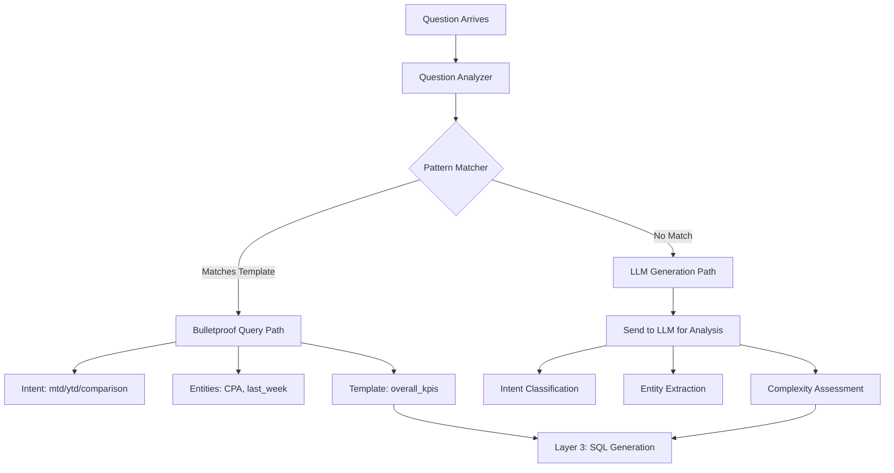
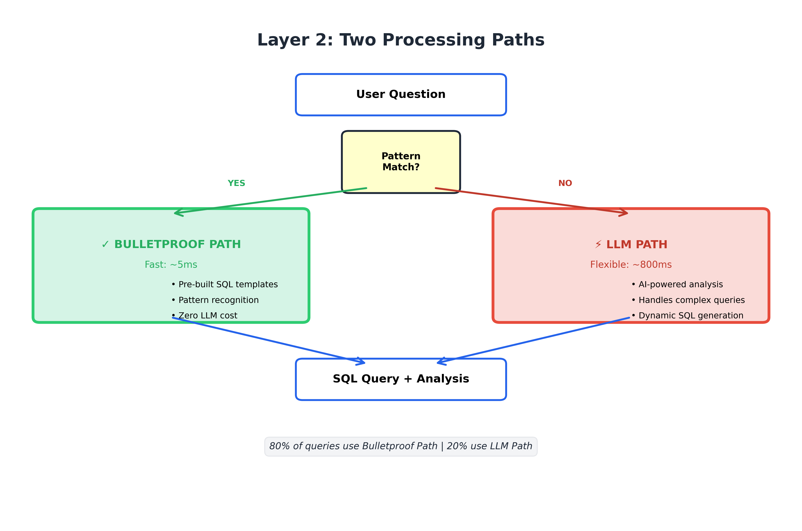
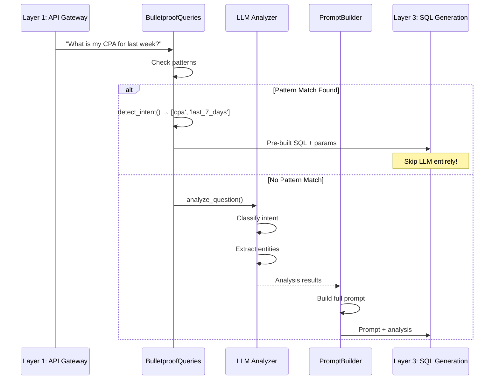

# Layer 2: Query Understanding & Intent Detection

## Overview
This layer is the "brain's first thought" - it analyzes your natural language question and figures out **what you're really asking for** before attempting to answer it.

---

## 📥 INPUT: What Comes From Layer 1

```python
{
  "user_id": "user_123",
  "question": "What is my CPA for last week?",
  "session_context": {
    "previous_questions": [...],
    "data_source": "campaigns.parquet"
  }
}
```

---

## ⚙️ WHAT HAPPENS INSIDE: The Analysis Pipeline



### The Two Processing Paths

#### Path A: Bulletproof Queries (Fast & Reliable)
**File**: `src/platform/query_engine/bulletproof_queries.py`

**When it's used**: For common, well-defined questions
**Advantage**: No LLM needed = faster + cheaper + more reliable

**Pattern Matching Logic**:
```python
QUERY_PATTERNS = {
    'week_comparison': [
        'compare last 2 weeks',
        'week over week',
        'wow performance'
    ],
    'mtd': [
        'month to date',
        'mtd performance',
        'this month so far'
    ],
    'ytd': [
        'year to date',
        'ytd',
        'this year performance'
    ],
    'total_spend': [
        'total spend',
        'how much spent',
        'overall budget'
    ]
}
```

**How it works**:
1. Convert question to lowercase
2. Check if any pattern keywords appear in the question
3. If match found, skip LLM and use pre-built SQL template

**Example**:
```
Question: "What is my CPA for last week?"



↓
Pattern Match: "last week" → matches 'last_7_days'
↓
Detected Intent: ['total_spend', 'last_7_days', 'cpa']
↓
Template Selected: overall_kpis(time_filter="last_7_days", focused_kpi="cpa")
```

---

#### Path B: LLM Analysis (Flexible & Intelligent)
**File**: `src/platform/query_engine/hybrid_retrieval.py`

**When it's used**: For complex, nuanced, or novel questions
**Advantage**: Can handle anything, even questions never seen before

**The analyze_question Function**:
```python
def analyze_question(question: str) -> Dict[str, Any]:
    """
    Uses an LLM to deeply understand the question
    
    Returns:
        {
            'intent': QueryIntent,        # COMPARISON, TREND, AGGREGATION
            'complexity': QueryComplexity, # SIMPLE, MODERATE, COMPLEX
            'entities': {
                'metrics': ['CPA', 'ROAS'],
                'dimensions': ['Platform', 'Campaign'],
                'time_range': 'last 30 days',
                'filters': ['Platform = Facebook']
            }
        }
    """
```

**Step-by-Step LLM Analysis**:

1. **Intent Classification**
   ```
   Question: "Show me which campaigns are underperforming compared to last month"
   ↓
   LLM thinks: This is asking for COMPARISON (current vs previous period)
   ↓
   Intent: QueryIntent.COMPARISON
   ```

2. **Complexity Assessment**
   ```
   Factors considered:
   - Number of metrics mentioned: 1 (underperforming = low ROAS/high CPA)
   - Number of time periods: 2 (current month vs last month)
   - Aggregation needed: Yes (by campaign)
   - Filtering needed: Yes (only underperforming)
   ↓
   Complexity: QueryComplexity.MODERATE
   ```

3. **Entity Extraction**
   ```python
   {
       'metrics': ['ROAS', 'CPA'],  # Inferred from "underperforming"
       'dimensions': ['Campaign_Name'],
       'time_range': {
           'current': 'this month',
           'comparison': 'last month'
       },
       'filters': ['performance < benchmark']
   }
   ```

---

## 🏢 COMPONENTS IN THIS LAYER

### 1. **BulletproofQueries** (`bulletproof_queries.py`)
**Role**: Pattern matcher and template selector

**Key Methods**:
- `detect_intent(question)` - Finds matching patterns
- `get_sql_for_question(question)` - Returns pre-built SQL if match found

**Patterns it recognizes**:
| Pattern | Example Questions |
|:---|:---|
| `week_comparison` | "Compare last 2 weeks", "WoW performance" |
| `mtd` | "Month to date", "MTD spend" |
| `ytd` | "Year to date", "YTD conversions" |
| `by_platform` | "Performance by channel", "Platform breakdown" |
| `daily_trend` | "Daily trend", "Performance over time" |

---

### 2. **HybridSQLRetrieval** (`hybrid_retrieval.py`)
**Role**: LLM-powered question analyzer

**Key Function**: `analyze_question(question)`

**What it does**:
```python
# Sends this prompt to the LLM:
"""
Analyze this marketing analytics question:
"{question}"

Classify the intent as one of:
- COMPARISON: Comparing two time periods or segments
- TREND: Looking at changes over time
- AGGREGATION: Summing up totals
- BREAKDOWN: Splitting by dimension

Extract:
- Metrics mentioned (spend, CPA, ROAS, etc.)
- Dimensions (Platform, Campaign, etc.)
- Time ranges
- Any filters or conditions
"""
```

**LLM Models Used** (in priority order):
1. **Gemini 2.5 Flash** (FREE) - First attempt
2. **DeepSeek** (FREE) - Fallback if Gemini fails
3. **GPT-4o** (PAID) - Final fallback

---

### 3. **PromptBuilder** (`prompt_builder.py`)
**Role**: Constructs the perfect prompt for the LLM

**What it adds to the prompt**:
```python
{
    "schema": "Available columns: Date, Platform, Spend, Conversions...",
    "marketing_context": "ROAS = Revenue / Spend, CPA = Spend / Conversions",
    "sql_rules": "Use NULLIF to prevent division by zero...",
    "query_analysis": {
        "intent": "COMPARISON",
        "complexity": "MODERATE"
    },
    "reference_date": "2026-01-07",
    "examples": [...]  # Few-shot learning examples
}
```

---

## 📤 OUTPUT: What Goes to Layer 3

### For Bulletproof Path:
```python
{
  "processing_path": "bulletproof",
  "template_name": "overall_kpis",
  "parameters": {
    "time_filter": "last_7_days",
    "focused_kpi": "cpa"
  },
  "sql_ready": True  # SQL already generated
}
```

### For LLM Path:
```python
{
  "processing_path": "llm_generation",
  "analysis": {
    "intent": "AGGREGATION",
    "complexity": "SIMPLE",
    "entities": {
      "metrics": ["CPA"],
      "time_range": "last 7 days"
    }
  },
  "prompt": "Full LLM prompt with schema + context",
  "sql_ready": False  # Needs Layer 3 to generate SQL
}
```

---

## 🔄 Complete Flow Diagram



---

## 🎓 Key Concepts for Beginners

### What is Intent Classification?
Intent is **what the user wants to do**. Examples:
- **COMPARISON**: "How does Facebook compare to Google?"
- **TREND**: "Show me spend over the last 30 days"
- **AGGREGATION**: "What's my total spend?"

### What is Entity Extraction?
Entities are the **specific things** mentioned in the question:
- **Metrics**: CPA, ROAS, Spend, Conversions
- **Dimensions**: Platform, Campaign, Device
- **Time**: "last week", "Q4 2025", "yesterday"

### Why Two Paths?
- **Bulletproof Path**: Like a vending machine - press button, get exact product
- **LLM Path**: Like a chef - can make anything you ask for, but takes longer

---

## 📊 Performance Metrics

| Metric | Bulletproof Path | LLM Path |
|:---|:---|:---|
| Average Time | ~5ms | ~800ms |
| Accuracy | 100% (for known patterns) | ~95% |
| Cost | $0 | ~$0.001 per query |
| Coverage | ~40% of questions | 100% of questions |

**Strategy**: Try bulletproof first (fast + free), fall back to LLM if needed

---

## 🔍 Real Example Walkthrough

**Question**: "Compare last 2 weeks performance"

### Step 1: Pattern Matching
```python
question_lower = "compare last 2 weeks performance"
patterns = QUERY_PATTERNS['week_comparison']
# patterns = ['compare last 2 weeks', 'week over week', 'wow']

if any(pattern in question_lower for pattern in patterns):
    # MATCH FOUND!
    return "week_comparison"
```

### Step 2: Intent Detection
```python
intents = ['week_comparison']
focused_kpi = None  # No specific KPI mentioned

# No LLM needed - we know exactly what to do
```

### Step 3: Template Selection
```python
if 'week_comparison' in intents:
    sql = BulletproofQueries.week_over_week_comparison()
    # Returns pre-built SQL with CTEs for current_period and previous_period
```

### Result
```
✅ Processed in 5ms
✅ No LLM API call needed
✅ 100% accurate SQL
➡️ Sent to Layer 3 for execution
```

---

> [!IMPORTANT]
> Layer 2 is the "decision maker" - it decides whether to use the fast, reliable path (bulletproof) or the flexible, intelligent path (LLM). This hybrid approach gives you the best of both worlds.
