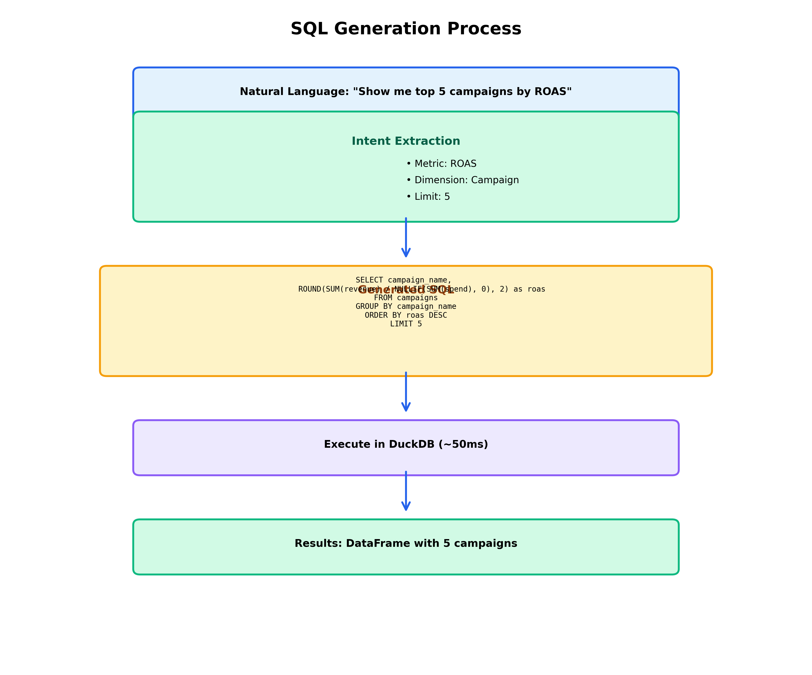

**CHAPTER 5**

**LAYER 3: DATA RETRIEVAL & SQL GENERATION**

---

**Navigation:** [← Chapter 4](file:///Users/ashwin/Desktop/pca_agent%20copy/guide/chapters/04_layer2_query_understanding.md) | [Index](file:///Users/ashwin/Desktop/pca_agent%20copy/guide/INDEX.md) | [Next: Chapter 6 →](file:///Users/ashwin/Desktop/pca_agent%20copy/guide/chapters/06_layer4_analysis.md)

---

## 5.1 Overview

Layer 3 is responsible for converting the query analysis from Layer 2 into actual SQL queries, executing them against the database, and returning structured data.

> **Office Analogy - The Records Department:**
>
> Imagine you need information from your company's records department. You submit a request: "I need all expense reports from last quarter."
>
> The records clerk:
> 1. **Understands your request** (already done by Layer 2)
> 2. **Knows which filing cabinet** to open (table selection)
> 3. **Knows which folders** to pull (column selection)
> 4. **Knows how to filter** the documents (WHERE clause)
> 5. **Organizes the results** (ORDER BY, GROUP BY)
> 6. **Hands you the documents** (returns DataFrame)
>
> That's exactly what Layer 3 does - it's your data records clerk!

**Time:** ~50-200ms  
**Input:** Query analysis from Layer 2  
**Output:** Pandas/Polars DataFrame with results

---

## 5.2 The Two SQL Generation Paths

Just like Layer 2 has two paths, Layer 3 also has two approaches:

### Path 1: Template-Based SQL (Fast)

> **Office Analogy - Pre-Printed Forms:**
>
> Your company has pre-printed expense report forms for common requests:
> - "Weekly expense summary" → Form A
> - "Department comparison" → Form B
> - "Top 10 spenders" → Form C
>
> The clerk just fills in the blanks (dates, department names) and hands you the completed form. Fast and reliable!

**When used:** For Bulletproof queries (80% of requests)  
**Speed:** ~50ms  
**How it works:**

```python
# Template example
WEEKLY_SUMMARY_TEMPLATE = """
SELECT 
    DATE_TRUNC('week', date) as week,
    SUM(spend) as total_spend,
    SUM(conversions) as total_conversions,
    ROUND(SUM(spend) / NULLIF(SUM(conversions), 0), 2) as cpa
FROM campaigns
WHERE date >= '{start_date}' AND date <= '{end_date}'
GROUP BY week
ORDER BY week DESC
"""

# Fill in the template
sql = WEEKLY_SUMMARY_TEMPLATE.format(
    start_date='2024-01-01',
    end_date='2024-01-07'
)
```

### Path 2: LLM-Generated SQL (Flexible)

> **Office Analogy - Custom Research:**
>
> Sometimes you ask for something unusual: "Show me all expenses over $500 that were submitted on Fridays in Q3, grouped by manager approval time."
>
> The clerk can't use a pre-printed form. They need to:
> 1. Think about which files to check
> 2. Figure out the right filters
> 3. Decide how to organize the results
> 4. Create a custom report
>
> This takes longer but handles any request!

**When used:** For complex LLM queries (20% of requests)  
**Speed:** ~200ms  
**How it works:**

The LLM receives:
- Database schema
- Available tables and columns
- Example queries
- User's natural language question

And generates:
```sql
SELECT 
    manager_name,
    COUNT(*) as approval_count,
    AVG(EXTRACT(EPOCH FROM (approved_at - submitted_at))/3600) as avg_hours_to_approve
FROM expenses
WHERE amount > 500
    AND EXTRACT(DOW FROM submitted_at) = 5  -- Friday
    AND submitted_at >= '2024-07-01'
    AND submitted_at < '2024-10-01'
GROUP BY manager_name
ORDER BY avg_hours_to_approve DESC
```

---

## 5.3 SQL Validation & Safety

> **Office Analogy - The Safety Checklist:**
>
> Before the records clerk executes your request, they check:
> - ✓ Are you asking for data you're allowed to see?
> - ✓ Is the request reasonable? (Not asking for 10 million records)
> - ✓ Will this request crash the system?
> - ✓ Are you trying to delete or modify data? (Not allowed!)
>
> If anything looks suspicious, they reject the request!

**Safety Checks:**

1. **Read-Only Validation**
   - Only SELECT statements allowed
   - No INSERT, UPDATE, DELETE, DROP

2. **Table Whitelist**
   - Only approved tables can be queried
   - Prevents access to sensitive system tables

3. **Row Limit Enforcement**
   - Maximum 10,000 rows per query
   - Prevents memory overflow

4. **Timeout Protection**
   - Queries must complete within 30 seconds
   - Prevents infinite loops

**Code Example:**

```python
def validate_sql(sql: str) -> bool:
    """Validate SQL query for safety"""
    
    # Check 1: Only SELECT allowed
    if not sql.strip().upper().startswith('SELECT'):
        raise ValueError("Only SELECT queries allowed")
    
    # Check 2: No dangerous keywords
    dangerous = ['DROP', 'DELETE', 'UPDATE', 'INSERT', 'ALTER', 'TRUNCATE']
    if any(keyword in sql.upper() for keyword in dangerous):
        raise ValueError("Dangerous SQL operation detected")
    
    # Check 3: Table whitelist
    allowed_tables = ['campaigns', 'ads', 'keywords', 'conversions']
    # ... validation logic
    
    return True
```

---

## 5.4 Database Technology: DuckDB

> **Technical Term - DuckDB:**
>
> **What it is:** An in-memory analytical database (like SQLite but for analytics)
>
> **Office Analogy:** 
> - **Traditional database (PostgreSQL):** A large filing room in the basement. You submit requests and wait for someone to go down, find the files, and bring them back up.
> - **DuckDB:** A filing cabinet right at your desk. Everything is in memory, so you can grab files instantly!
>
> **Why it's fast:**
> - All data loaded in RAM (no disk access)
> - Columnar storage (reads only needed columns)
> - Vectorized execution (processes thousands of rows at once)

**Performance Comparison:**

| Database | Query Time | Use Case |
|----------|-----------|----------|
| PostgreSQL | 2-5 seconds | Large datasets, concurrent users |
| DuckDB | 50-200ms | Analytics, single user, in-memory |
| SQLite | 500ms-2s | Small datasets, embedded |

---

## 5.5 Data Format: Parquet Files

> **Technical Term - Parquet:**
>
> **What it is:** A columnar file format for storing data efficiently
>
> **Office Analogy - Filing System:**
>
> **Row-based storage (CSV):**
> ```
> File 1: John, Sales, $50k, 2024
> File 2: Mary, Marketing, $60k, 2024
> File 3: Bob, Sales, $55k, 2024
> ```
> To find all Sales employees, you must read ALL files!
>
> **Column-based storage (Parquet):**
> ```
> Names file: John, Mary, Bob
> Department file: Sales, Marketing, Sales
> Salary file: $50k, $60k, $55k
> Year file: 2024, 2024, 2024
> ```
> To find all Sales employees, you only read the Department file!
>
> **Result:** 10-100x faster for analytics!

**Parquet Benefits:**

1. **Compression:** 5-10x smaller than CSV
2. **Speed:** Only read columns you need
3. **Type Safety:** Stores data types (no parsing needed)
4. **Metadata:** Built-in statistics for query optimization

---

## 5.6 Query Execution Flow



**Step-by-Step Process:**

### Step 1: Receive Query Analysis

**Input from Layer 2:**
```python
{
    "intent": "COMPARISON",
    "metrics": ["spend", "conversions", "cpa"],
    "dimensions": ["week"],
    "time_range": {
        "start": "2024-01-01",
        "end": "2024-01-14"
    },
    "template": "week_over_week"
}
```

### Step 2: Select SQL Generation Method

```python
if query_analysis.get("template"):
    # Use template-based generation (fast)
    sql = generate_from_template(query_analysis)
else:
    # Use LLM-based generation (flexible)
    sql = generate_with_llm(query_analysis)
```

### Step 3: Generate SQL

**Template-based:**
```python
def generate_from_template(analysis):
    template = SQL_TEMPLATES[analysis["template"]]
    return template.format(
        metrics=", ".join(analysis["metrics"]),
        start_date=analysis["time_range"]["start"],
        end_date=analysis["time_range"]["end"]
    )
```

**LLM-based:**
```python
def generate_with_llm(analysis):
    prompt = f"""
    Generate SQL for DuckDB to answer this question:
    
    Intent: {analysis["intent"]}
    Metrics: {analysis["metrics"]}
    Dimensions: {analysis["dimensions"]}
    Time Range: {analysis["time_range"]}
    
    Available tables:
    - campaigns (date, campaign_name, spend, conversions, clicks, impressions)
    
    Return only the SQL query.
    """
    
    sql = llm.generate(prompt)
    return sql
```

### Step 4: Validate SQL

```python
validate_sql(sql)  # Throws exception if unsafe
```

### Step 5: Execute Query

```python
import duckdb

# Connect to database
conn = duckdb.connect('data/campaigns.duckdb')

# Execute query
result = conn.execute(sql).fetchdf()  # Returns Pandas DataFrame

# Close connection
conn.close()
```

### Step 6: Return DataFrame

**Output to Layer 4:**
```python
{
    "data": result,  # Pandas DataFrame
    "sql": sql,      # The executed SQL
    "rows": len(result),
    "execution_time_ms": 87
}
```

---

## 5.7 Common SQL Templates

### Template 1: Time Series Aggregation

```sql
SELECT 
    DATE_TRUNC('{granularity}', date) as period,
    SUM(spend) as total_spend,
    SUM(conversions) as total_conversions,
    ROUND(SUM(spend) / NULLIF(SUM(conversions), 0), 2) as cpa
FROM campaigns
WHERE date >= '{start_date}' AND date <= '{end_date}'
GROUP BY period
ORDER BY period
```

### Template 2: Top N by Metric

```sql
SELECT 
    {dimension} as name,
    SUM({metric}) as total
FROM campaigns
WHERE date >= '{start_date}' AND date <= '{end_date}'
GROUP BY {dimension}
ORDER BY total DESC
LIMIT {limit}
```

### Template 3: Comparison (This vs Last Period)

```sql
WITH current_period AS (
    SELECT SUM({metric}) as current_value
    FROM campaigns
    WHERE date >= '{current_start}' AND date <= '{current_end}'
),
previous_period AS (
    SELECT SUM({metric}) as previous_value
    FROM campaigns
    WHERE date >= '{previous_start}' AND date <= '{previous_end}'
)
SELECT 
    current_value,
    previous_value,
    ROUND((current_value - previous_value) / NULLIF(previous_value, 0) * 100, 2) as percent_change
FROM current_period, previous_period
```

---

## 5.8 Performance Optimization

> **Office Analogy - Efficiency Tips:**
>
> A smart records clerk knows tricks to work faster:
> - **Index cards** (database indexes) - find files instantly
> - **Summary sheets** (pre-aggregated data) - don't recalculate every time
> - **Recent requests folder** (query cache) - common requests already prepared
> - **Batch processing** (query optimization) - handle multiple requests together

**Optimization Techniques:**

1. **Indexes on Common Columns**
   ```sql
   CREATE INDEX idx_date ON campaigns(date);
   CREATE INDEX idx_campaign ON campaigns(campaign_name);
   ```

2. **Materialized Views for Common Aggregations**
   ```sql
   CREATE TABLE daily_summary AS
   SELECT 
       date,
       SUM(spend) as daily_spend,
       SUM(conversions) as daily_conversions
   FROM campaigns
   GROUP BY date;
   ```

3. **Query Result Caching**
   ```python
   # Cache results for 5 minutes
   @cache(ttl=300)
   def execute_query(sql: str):
       return conn.execute(sql).fetchdf()
   ```

4. **Partition Pruning**
   ```sql
   -- Only scan relevant date partitions
   WHERE date >= '2024-01-01'  -- Skips older partitions
   ```

---

## 5.9 Error Handling

**Common Errors and Solutions:**

| Error | Cause | Solution |
|-------|-------|----------|
| `Table not found` | Typo in table name | Use table whitelist |
| `Column not found` | Invalid column reference | Validate against schema |
| `Query timeout` | Query too complex | Add LIMIT clause |
| `Out of memory` | Too many rows | Enforce row limits |
| `Division by zero` | NULL values | Use NULLIF() |

**Error Response Example:**

```python
{
    "success": False,
    "error": "Query timeout after 30 seconds",
    "suggestion": "Try adding a date filter to reduce data volume",
    "fallback_sql": "SELECT * FROM campaigns LIMIT 100"
}
```

---

## 5.10 Real Example Walkthrough

**User Question:** "Show me top 5 campaigns by ROAS last week"

**Step 1: Input from Layer 2**
```python
{
    "intent": "TOP_N",
    "metric": "roas",
    "dimension": "campaign_name",
    "limit": 5,
    "time_range": {"start": "2024-01-01", "end": "2024-01-07"},
    "template": "top_n_by_metric"
}
```

**Step 2: Generate SQL from Template**
```sql
SELECT 
    campaign_name,
    ROUND(SUM(revenue) / NULLIF(SUM(spend), 0), 2) as roas
FROM campaigns
WHERE date >= '2024-01-01' AND date <= '2024-01-07'
GROUP BY campaign_name
ORDER BY roas DESC
LIMIT 5
```

**Step 3: Execute in DuckDB**
```python
result = conn.execute(sql).fetchdf()
```

**Step 4: Output DataFrame**
```
   campaign_name  roas
0  Brand Search   4.50
1  Retargeting    3.20
2  Display Ads    2.10
3  Social Media   1.80
4  Email Campaign 1.50
```

**Execution Time:** 87ms

---

## 5.11 Key Takeaways

✅ **Layer 3 is the data retrieval specialist**  
✅ **Two paths:** Templates (fast) vs LLM (flexible)  
✅ **DuckDB:** In-memory analytics database for speed  
✅ **Parquet:** Columnar storage for efficiency  
✅ **Safety first:** Validation prevents dangerous queries  
✅ **Performance:** 50-200ms typical query time  

> **Remember:** Layer 3 is like your company's records clerk - they know where everything is stored, how to find it quickly, and how to organize it for you. They're fast, reliable, and always follow safety protocols!

---

**Navigation:** [← Chapter 4](file:///Users/ashwin/Desktop/pca_agent%20copy/guide/chapters/04_layer2_query_understanding.md) | [Index](file:///Users/ashwin/Desktop/pca_agent%20copy/guide/INDEX.md) | [Next: Chapter 6 →](file:///Users/ashwin/Desktop/pca_agent%20copy/guide/chapters/06_layer4_analysis.md)
