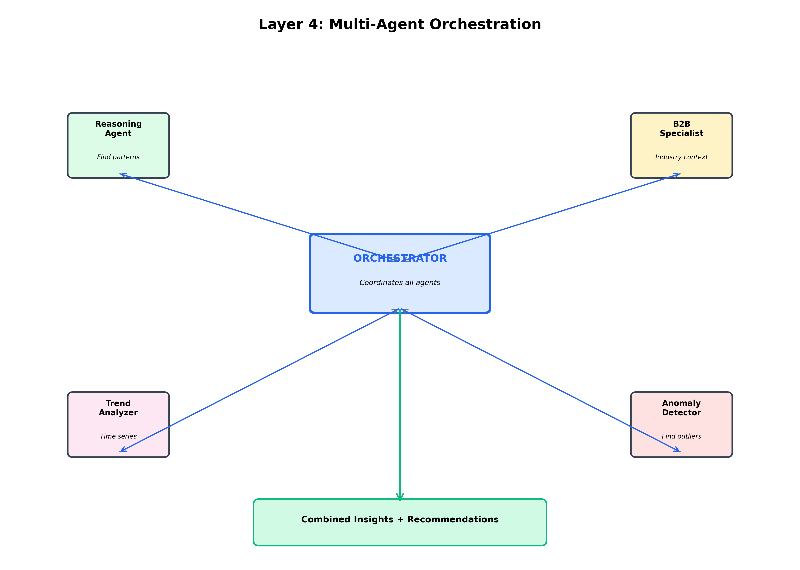

**CHAPTER 6**

**LAYER 4: ANALYSIS & INTELLIGENCE**

---

**Navigation:** [← Chapter 5](file:///Users/ashwin/Desktop/pca_agent%20copy/guide/chapters/05_layer3_data_retrieval.md) | [Index](file:///Users/ashwin/Desktop/pca_agent%20copy/guide/INDEX.md) | [Next: Chapter 7 →](file:///Users/ashwin/Desktop/pca_agent%20copy/guide/chapters/07_layer5_visualization.md)

---

## 6.1 Overview

Layer 4 is the intelligence core of the PCA Agent. This is where raw data transforms into actionable insights through multi-agent AI orchestration.

> **Office Analogy - The Analysis Team:**
>
> Imagine you have a team of expert consultants analyzing your marketing data:
> - **Senior Analyst (Reasoning Agent):** Finds patterns and trends in the numbers
> - **Industry Expert (B2B Specialist):** Adds context about your specific industry
> - **Trend Forecaster:** Predicts what will happen next
> - **Auditor (Anomaly Detector):** Spots unusual patterns that need attention
> - **Project Manager (Orchestrator):** Coordinates everyone and compiles the final report
>
> That's exactly what Layer 4 does - it's like having a team of AI consultants!

**Time:** ~500-2000ms  
**Input:** DataFrame from Layer 3  
**Output:** List of insights with priorities and recommendations



---

## 6.2 Multi-Agent Architecture

### The Orchestrator Pattern

> **Office Analogy - The Project Manager:**
>
> Think of a project manager coordinating a team:
> 1. **Receives the task** (analyze this data)
> 2. **Breaks it down** into subtasks
> 3. **Assigns work** to specialists
> 4. **Collects results** from each person
> 5. **Combines everything** into a final report
> 6. **Prioritizes** the most important findings
>
> The Orchestrator does exactly this with AI agents!

**Why Multiple Agents?**

Instead of one giant AI trying to do everything, we have specialized agents:

| Agent | Specialty | Office Equivalent |
|-------|-----------|-------------------|
| **Reasoning Agent** | Pattern detection | Data Analyst |
| **B2B Specialist** | Industry context | Industry Consultant |
| **Trend Analyzer** | Time series forecasting | Market Researcher |
| **Anomaly Detector** | Outlier identification | Quality Auditor |
| **Orchestrator** | Coordination | Project Manager |

**Benefits:**
- **Specialization:** Each agent is expert in one thing
- **Parallel Processing:** Multiple agents work simultaneously
- **Modularity:** Easy to add/remove agents
- **Cost Efficiency:** Use cheaper models for simple tasks

---

## 6.3 Agent 1: Reasoning Agent

> **What it does:** Analyzes data to find patterns, trends, and correlations

> **Office Analogy:** The senior data analyst who looks at spreadsheets and says "Aha! I notice that whenever we increase Facebook spend, our CPA goes down, but only on weekends!"

### Capabilities

**1. Trend Detection**
```python
# Example insight
"Spend has increased 23% week-over-week for the past 3 weeks, 
indicating an aggressive scaling strategy"
```

**2. Correlation Analysis**
```python
# Example insight
"Strong negative correlation (-0.85) between ad frequency and CTR, 
suggesting ad fatigue"
```

**3. Comparative Analysis**
```python
# Example insight
"Google Search campaigns outperform Facebook by 45% on ROAS, 
but Facebook has 3x higher volume"
```

**4. Threshold Violations**
```python
# Example insight
"CPA exceeded target threshold ($15) on 12 out of 14 days, 
requiring immediate optimization"
```

### How It Works

**Input:**
```python
{
    "data": DataFrame[date, campaign, spend, conversions, roas],
    "question": "How are my campaigns performing?",
    "context": "User wants overall performance assessment"
}
```

**Process:**
1. Calculate key metrics (averages, totals, growth rates)
2. Identify trends (increasing, decreasing, stable)
3. Find correlations between metrics
4. Compare against benchmarks
5. Generate natural language insights

**Output:**
```python
[
    {
        "insight": "Total spend increased 23% WoW",
        "priority": "high",
        "category": "trend",
        "confidence": 0.95
    },
    {
        "insight": "ROAS declined 8% despite increased spend",
        "priority": "critical",
        "category": "performance",
        "confidence": 0.92
    }
]
```

---

## 6.4 Agent 2: B2B Specialist

> **What it does:** Adds industry-specific context and best practices

> **Office Analogy:** The industry consultant who says "In the SaaS industry, a $50 CPA is actually excellent because the lifetime value is typically $2,000+"

### Industry Knowledge

The B2B Specialist has deep knowledge of:
- **SaaS:** Long sales cycles, high LTV, focus on MQL quality
- **E-commerce:** Short sales cycles, focus on ROAS and AOV
- **B2B Services:** Relationship-based, focus on lead quality
- **Financial Services:** Compliance-heavy, focus on qualified leads

### Capabilities

**1. Benchmark Comparison**
```python
# Example insight
"Your $45 CPA is 23% below the SaaS industry average of $58, 
indicating efficient acquisition"
```

**2. Best Practice Recommendations**
```python
# Example insight
"For B2B SaaS, consider increasing spend on LinkedIn where 
decision-makers are more active than Facebook"
```

**3. Seasonality Context**
```python
# Example insight
"Q4 typically sees 30-40% higher CPAs in B2B due to budget 
exhaustion and holiday slowdowns"
```

**4. Channel-Specific Advice**
```python
# Example insight
"Google Search works well for high-intent SaaS buyers, 
while Display is better for brand awareness"
```

---

## 6.5 Agent 3: Trend Analyzer

> **What it does:** Forecasts future performance based on historical patterns

> **Office Analogy:** The market researcher who looks at past sales data and predicts "Based on the last 6 months, I expect sales to increase 15% next quarter"

### Forecasting Methods

**1. Linear Trend**
- Simple growth/decline patterns
- Good for stable metrics

**2. Moving Average**
- Smooths out short-term fluctuations
- Good for noisy data

**3. Seasonal Decomposition**
- Identifies weekly/monthly patterns
- Good for recurring cycles

**4. Prophet (Facebook's Algorithm)**
- Advanced time series forecasting
- Handles holidays and seasonality

### Example Insights

```python
# Trend projection
"At current growth rate (5% WoW), spend will reach $100k/week 
by end of quarter"

# Seasonality detection
"Conversions consistently peak on Tuesdays and Wednesdays, 
dropping 30% on weekends"

# Forecast with confidence
"Predicted ROAS for next week: 3.2 (±0.4) based on 8-week trend"
```

---

## 6.6 Agent 4: Anomaly Detector

> **What it does:** Identifies unusual patterns that need immediate attention

> **Office Analogy:** The quality auditor who reviews reports and flags "Wait, this number doesn't make sense - we've never spent $50k in one day before!"

### Anomaly Types

**1. Statistical Outliers**
```python
# Example
"Spend on 2024-01-15 was $45k, 4.2 standard deviations above 
the 30-day average of $12k"
```

**2. Sudden Changes**
```python
# Example
"CPA jumped from $15 to $67 overnight - possible tracking issue 
or campaign misconfiguration"
```

**3. Missing Data**
```python
# Example
"No conversion data recorded for 2024-01-10, but spend continued - 
check tracking pixel"
```

**4. Impossible Values**
```python
# Example
"ROAS of 0.02 detected - this means $1 spent generated $0.02 revenue, 
likely a data error"
```

### Detection Methods

- **Z-Score:** Measures how many standard deviations from mean
- **IQR (Interquartile Range):** Identifies values outside normal range
- **Moving Average Deviation:** Compares to recent trends
- **Domain Rules:** Business logic (e.g., CPA can't be negative)

---

## 6.7 The Orchestrator

> **What it does:** Coordinates all agents and combines their outputs

> **Office Analogy:** The project manager who collects reports from all team members, removes duplicates, prioritizes findings, and creates the executive summary

### Orchestration Flow

**Step 1: Task Distribution**
```python
# Orchestrator sends data to all agents in parallel
tasks = [
    reasoning_agent.analyze(data),
    b2b_specialist.contextualize(data, industry="SaaS"),
    trend_analyzer.forecast(data),
    anomaly_detector.scan(data)
]

# Wait for all to complete
results = await asyncio.gather(*tasks)
```

**Step 2: Deduplication**
```python
# Remove duplicate insights
# Example: Both Reasoning and Anomaly might flag the same spike
unique_insights = deduplicate(results)
```

**Step 3: Prioritization**
```python
# Rank by importance
priorities = {
    "critical": ["data_error", "budget_overrun", "zero_conversions"],
    "high": ["significant_trend", "threshold_violation"],
    "medium": ["minor_trend", "benchmark_comparison"],
    "low": ["general_observation"]
}
```

**Step 4: Synthesis**
```python
# Combine related insights
# Example: "Spend increased 20%" + "ROAS decreased 10%" 
# → "Efficiency declining despite scale"
```

**Step 5: Recommendation Generation**
```python
# Based on all insights, suggest actions
recommendations = [
    "Reduce spend on underperforming campaigns",
    "Increase budget for high-ROAS channels",
    "Investigate tracking issue on Campaign X"
]
```

---

## 6.8 Insight Prioritization

### Priority Levels

| Priority | Criteria | Action Required | Example |
|----------|----------|-----------------|---------|
| **CRITICAL** | Data errors, budget overruns | Immediate | "No conversions tracked for 3 days" |
| **HIGH** | Significant trends, threshold violations | Within 24h | "CPA 50% above target" |
| **MEDIUM** | Notable patterns, opportunities | This week | "Google outperforming Facebook" |
| **LOW** | General observations | FYI only | "Spend consistent with last week" |

### Confidence Scores

Each insight includes a confidence score:

```python
{
    "insight": "ROAS declining",
    "confidence": 0.95,  # 95% confident
    "evidence": "8-week consistent downward trend, p-value < 0.01"
}
```

**Confidence Factors:**
- **Data quality:** More data = higher confidence
- **Statistical significance:** p-value < 0.05
- **Consistency:** Multiple agents agree
- **Historical accuracy:** Past predictions were correct

---

## 6.9 Real Example Walkthrough

**User Question:** "How are my campaigns performing?"

**Input Data:**
```
   date        campaign      spend  conversions  roas
0  2024-01-01  Google Search  $5k    45          3.2
1  2024-01-01  Facebook       $3k    20          2.1
...
```

**Agent Outputs:**

**Reasoning Agent:**
```python
[
    "Total spend: $127k (↑15% vs last week)",
    "Total conversions: 1,234 (↑8% vs last week)",
    "Average ROAS: 2.8 (↓5% vs last week)",
    "Google Search is top performer with 3.5 ROAS"
]
```

**B2B Specialist:**
```python
[
    "Your $42 CPA is excellent for B2B SaaS (industry avg: $65)",
    "LinkedIn typically outperforms Facebook for B2B - consider testing",
    "Q1 is strong season for SaaS - good time to scale"
]
```

**Trend Analyzer:**
```python
[
    "Spend growing 15% WoW for 4 consecutive weeks",
    "ROAS declining 3-5% WoW - efficiency decreasing",
    "Forecast: If trend continues, ROAS will hit 2.5 in 2 weeks"
]
```

**Anomaly Detector:**
```python
[
    "⚠️ Facebook CPA spiked to $89 on Jan 15 (normal: $45)",
    "✓ No data quality issues detected",
    "✓ All campaigns within budget limits"
]
```

**Orchestrator Output:**
```python
{
    "summary": "Campaigns are scaling well (+15% spend) but efficiency 
                is declining (-5% ROAS). Google Search is your best 
                performer. Facebook had an anomaly on Jan 15.",
    
    "insights": [
        {
            "text": "Facebook CPA spiked to $89 on Jan 15",
            "priority": "high",
            "category": "anomaly",
            "confidence": 0.98
        },
        {
            "text": "ROAS declining 5% WoW despite 15% spend increase",
            "priority": "high",
            "category": "trend",
            "confidence": 0.92
        },
        {
            "text": "Google Search outperforming with 3.5 ROAS",
            "priority": "medium",
            "category": "performance",
            "confidence": 0.95
        }
    ],
    
    "recommendations": [
        "Investigate Facebook spike on Jan 15 - possible ad set issue",
        "Consider reducing Facebook spend and reallocating to Google",
        "Monitor ROAS trend - may need optimization if decline continues"
    ]
}
```

---

## 6.10 Performance Optimization

### Parallel Processing

All agents run simultaneously:

```python
# Sequential (slow): 2000ms total
result1 = reasoning_agent.analyze()      # 500ms
result2 = b2b_specialist.contextualize() # 500ms
result3 = trend_analyzer.forecast()      # 500ms
result4 = anomaly_detector.scan()        # 500ms

# Parallel (fast): 500ms total
results = await asyncio.gather(
    reasoning_agent.analyze(),
    b2b_specialist.contextualize(),
    trend_analyzer.forecast(),
    anomaly_detector.scan()
)
```

**Speedup:** 4x faster with parallel execution!

### Caching

Expensive computations are cached:

```python
@cache(ttl=300)  # Cache for 5 minutes
def calculate_trends(data):
    # Expensive statistical analysis
    return trends
```

### Smart Agent Selection

Not all agents run for every query:

```python
if query_type == "simple_metric":
    # Only use Reasoning Agent
    agents = [reasoning_agent]
elif query_type == "trend_analysis":
    # Use Reasoning + Trend Analyzer
    agents = [reasoning_agent, trend_analyzer]
else:
    # Use all agents
    agents = [reasoning_agent, b2b_specialist, trend_analyzer, anomaly_detector]
```

---

## 6.11 Key Takeaways

✅ **Layer 4 is the intelligence core** - transforms data into insights  
✅ **Multi-agent architecture** - specialized AI agents working together  
✅ **Orchestrator coordinates** - manages all agents and combines outputs  
✅ **Parallel processing** - all agents run simultaneously for speed  
✅ **Prioritized insights** - critical issues flagged first  
✅ **Actionable recommendations** - not just analysis, but what to do  

> **Remember:** Layer 4 is like having a team of expert consultants analyzing your data 24/7. Each consultant (agent) has their specialty, and the project manager (orchestrator) makes sure you get a comprehensive, prioritized report!

---

**Navigation:** [← Chapter 5](file:///Users/ashwin/Desktop/pca_agent%20copy/guide/chapters/05_layer3_data_retrieval.md) | [Index](file:///Users/ashwin/Desktop/pca_agent%20copy/guide/INDEX.md) | [Next: Chapter 7 →](file:///Users/ashwin/Desktop/pca_agent%20copy/guide/chapters/07_layer5_visualization.md)
